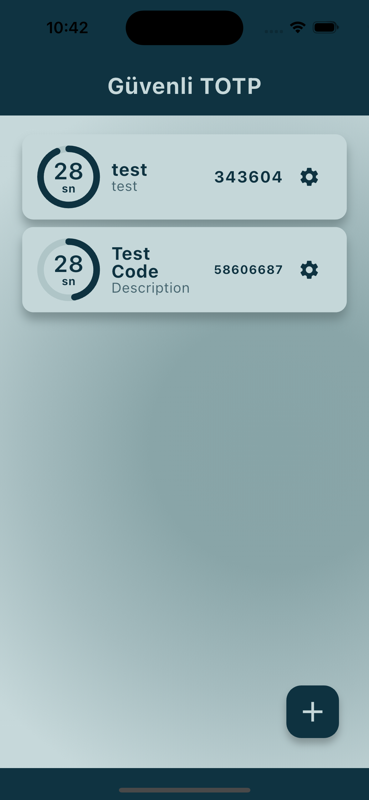
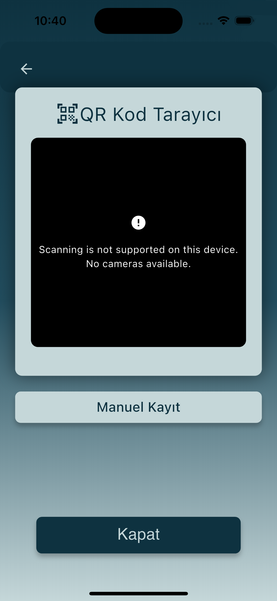
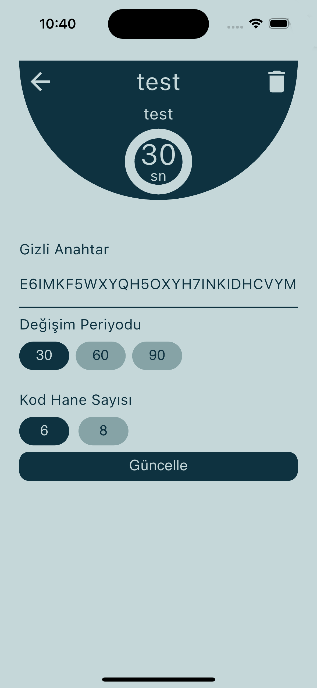

# Secure TOTP Application

First, run app.

Then add a Time Based OTP entry with QR Code or manually.

TOTP Secret codes must be valid Base32 strings.

Title cannot be longer than 10 characters and description is can be maximum 15 characters length.

Then select time frame for OTP code generation. You can use 30, 60 and 90 seconds.

Finally select the OTP code digit count. 6 and 8 can be selected.

Your OTP codes will be listed on the main screen and will be updated automatically.

